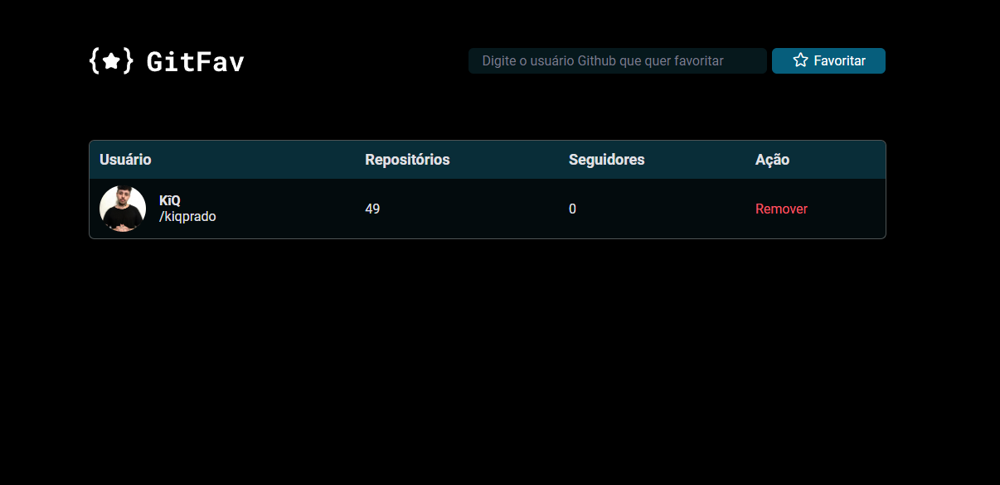
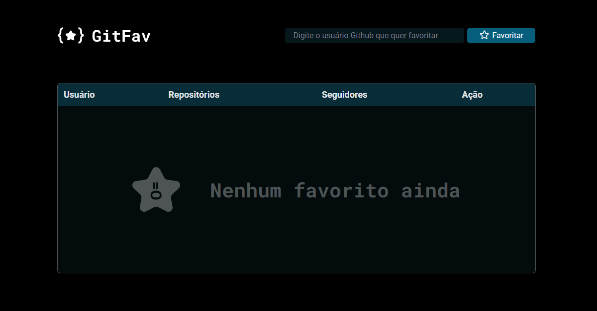

<h1 align="center"> GitFav. </h1>

Seus Perfis favoritos á um click.

 

  

  

## 🚀 Tecnologias

Esse projeto foi desenvolvido com as seguintes tecnologias:

- HTML e CSS
- JavaScript

## 💻 Projeto

Você pode visualizar o resultado clincando neste [LINK](https://kiqprado.github.io/GitFav/).

---

 
  
  &nbsp;&nbsp;&nbsp;|&nbsp;&nbsp;&nbsp;
  
 

